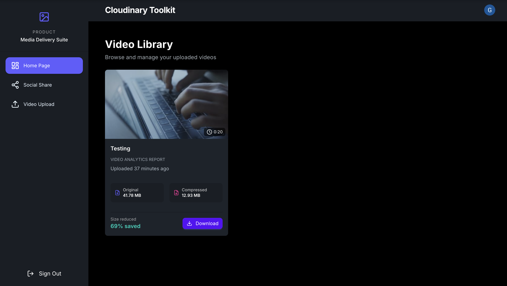

# Cloudinary Toolkit – Media Delivery SaaS

A full-stack SaaS platform for **video upload, compression, analytics reporting, and automated email notifications**. Built to demonstrate real-world product engineering using modern cloud and web technologies.

This project simulates how production media platforms work – from authentication and storage to background processing and transactional emails.

---

## 🚀 Live Demo

👉 https://cloudinary-toolkit.onrender.com/

---

## ✨ Features

- 🔐 **Secure Authentication**

  - User login & session management using **Clerk**

- ☁️ **Cloud Video Upload & Optimization**

  - Upload videos to **Cloudinary**
  - Automatic compression & format optimization

- 📊 **Video Analytics**

  - Original file size
  - Compressed size
  - Compression percentage
  - Duration tracking

- 📩 **Automated Email Reports**

  - Analytics report sent automatically after upload
  - Transactional emails using **Resend**

- 🗄 **Database Persistence**

  - Metadata stored using **PostgreSQL (Neon)**
  - ORM: **Prisma**

- ⚡ **Event-Driven Backend**

  - Upload → Process → Save → Notify pipeline

- 🚀 **CI/CD Enabled**
  - Auto-deploy on every GitHub push using **Render**

---

## 🛠 Tech Stack

**Frontend**

- Next.js 14 (App Router)
- TypeScript
- Tailwind CSS
- DaisyUI

**Backend**

- Next.js API Routes (Node.js)

**Auth**

- Clerk

**Media Storage**

- Cloudinary

**Database**

- PostgreSQL (Neon)
- Prisma ORM

**Email**

- Resend (Transactional emails)

**Deployment**

- Render (Auto deploy from GitHub)

---

## 🧠 System Architecture

User Uploads Video  
 ↓  
Cloudinary Processing  
 ↓  
Database Storage  
 ↓  
Analytics Generation  
 ↓  
Automated Email Report

---

## ⚙️ Environment Variables

Create a `.env` file and add:

NEXT_PUBLIC_CLOUDINARY_CLOUD_NAME=  
CLOUDINARY_API_KEY=  
CLOUDINARY_API_SECRET=

DATABASE_URL=

CLERK_SECRET_KEY=  
NEXT_PUBLIC_CLERK_PUBLISHABLE_KEY=

RESEND_API_KEY=

---

## 🏃 Run Locally

npm install  
npm run dev

App runs on:

http://localhost:3000

---

## 🔐 Email Sandbox Note

This project uses Resend free tier.

> Free tier allows sending emails only to verified recipients.

---

## 📸 Screenshots

---

## 📈 Future Enhancements

- PDF analytics reports
- Multi-language support
- Billing integration

---

## 👨‍💻 Author

**Gaurav Ambasta**

---

## ⭐ If you like this project

Star ⭐ the repo and feel free to contribute!
